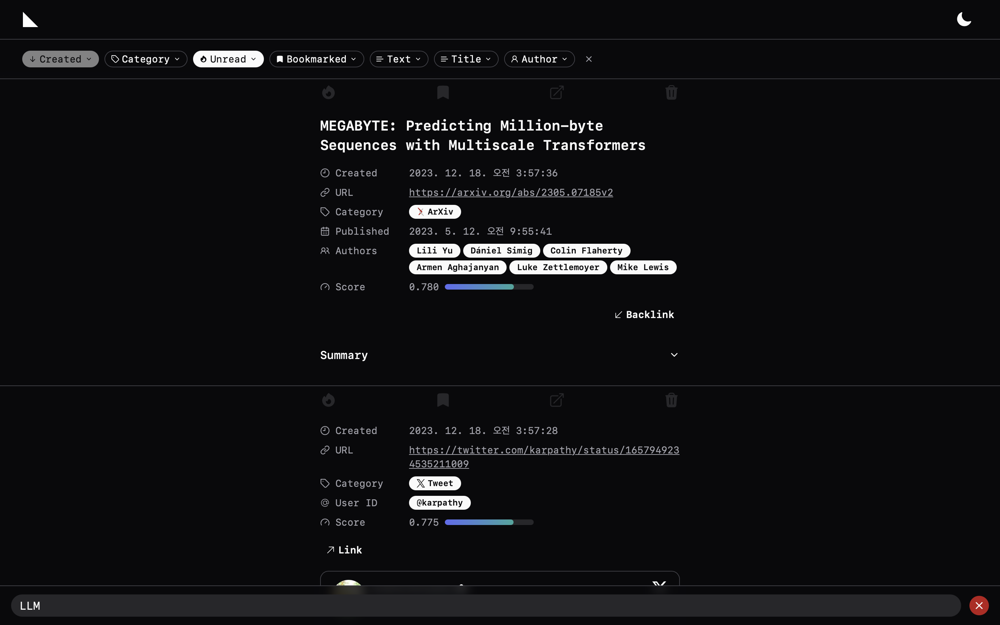
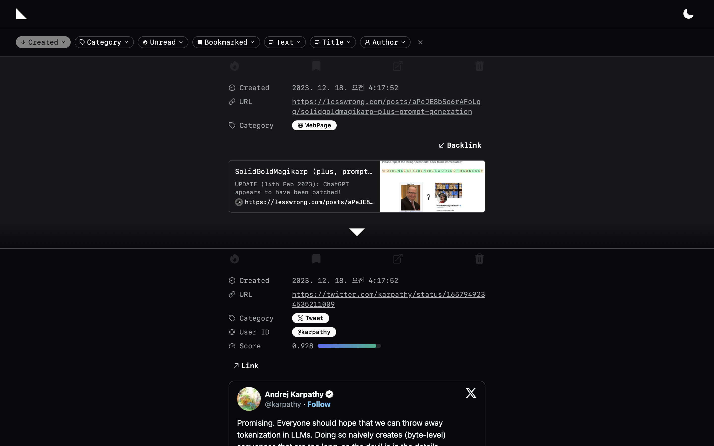
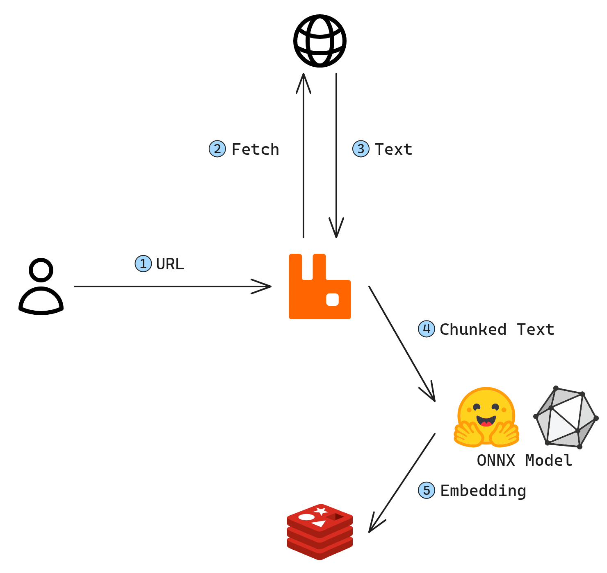
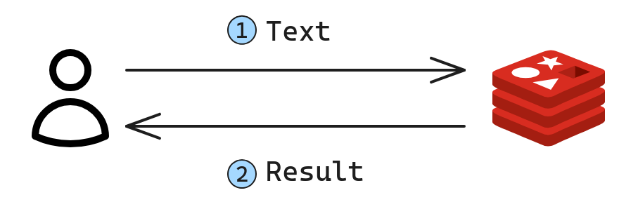

# fold


_Manage your collected documents and perform vector-based searches._

## Supported features

- Web scraping to store text and metadata information
- Vector-based text search and similar document search
- Search by category, author, title, and content
- Document read-marking, bookmarking, document linking, and backlinking

## How to use

1. **Clone the Repository**: Start by cloning the repository to your local machine.

   ```bash
   git clone https://github.com/yun-u/fold.git
   cd fold
   ```

2. **Environment Setup**: Create a `.env` file in the root directory to store your environment variables.

   ```bash
   touch .env
   ```

   The example of `.env` file with necessary variables. This includes specifying the index name for Redis Search, ONNX model path, default Huggingface model ID, X user credentials, Papago API credentials, service hostnames, and the Arxiv directory to save PDF files.

   ```
   INDEX_NAME=idx
   ONNX_MODEL_HOME=/app/onnx_model

   DEFAULT_MODEL_ID=thenlper/gte-base

   X_ID=YOUR_X_ID
   X_PASSWORD=YOUR_X_PASSWORD

   PAPAGO_ID=YOUR_PAPAGO_ID
   PAPAGO_SECRET=YOUR_PAPAGO_SECRET

   RABBITMQ_HOST=rabbitmq
   REDIS_HOST=redis
   XSERVICE_HOST=xservice

   ARXIV_HOME=/arxiv
   ```

3. **Starting the Application**: Launch the application using Docker Compose. This will start all the necessary services defined in the `docker-compose.yml` file, including your application server, database, and any other dependent services. Make sure Docker is installed and running on your machine. Then, execute the following command in the root directory of the project:

   ```bash
   docker compose up
   ```

   This command initializes and starts all the containers required for the application. The services will be set up based on the configurations provided in the Docker Compose file and the `.env` file.

4. **Using the API**: To utilize the app's functionality, use the provided API endpoint. For instance, to embed a document from a URL, you can use a curl command like the following:

   ```bash
   curl -X POST \
   -H "Content-Type: application/json"\
   http://localhost/api/embed \
   -d '{
       "url": "https://arxiv.org/abs/1706.03762"
   }'
   ```

## Demo

The screenshot shows the main page of the interface. At the top, there is a filter bar that enables filtering based on various options. Below that, there is a search bar for vector searching. In the middle section, collected documents can be scrolled through vertically. Each document provides options to check linked and documents, mark as read, bookmark, and delete.


Based on the cosine similarity between embeddings, it shows documents similar to the text entered in the search bar below. The results will be shown along with their cosine similarity scores, which are rescaled between 0 and 1.



Displays documents that are similar to other documents based on cosine similarity between their embeddings.



## How it Works

### Embed

To run the Huggingface model on a CPU, it is converted into an Optimized & Quantized ONNX model.

The system fetches text data from a URL provided by the user. This text is then segmented into sentences based on full stops ('.'). These sentences are further divided into chunks based on the model's context length. The embeddings for each chunk are calculated and stored in Redis.



### Search

RedisSearch has been used to implement vector search.



## Tech Stack

### OS


### ML/DL

 

### Backend

  

 

### Frontend

    
