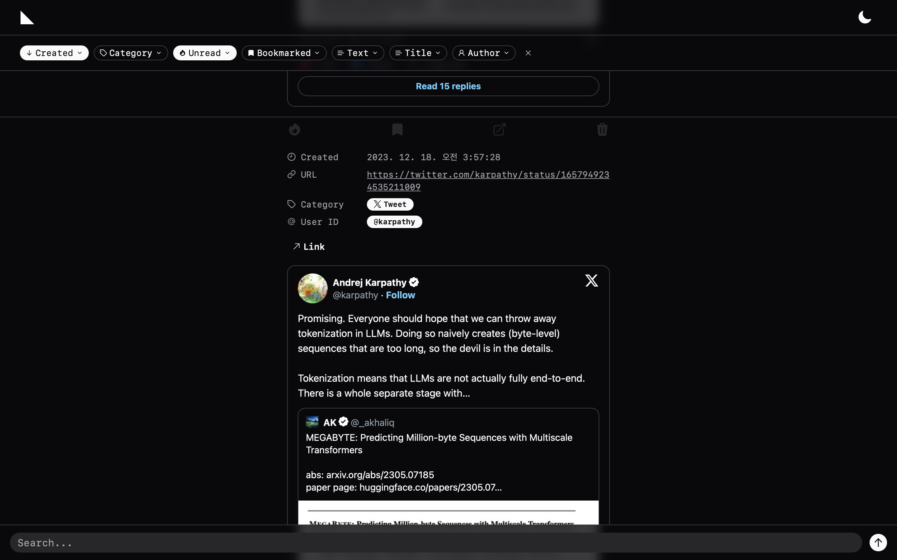

# fold

_**Manage linked documents and utilize vector search.**_

## Features

The screenshot shows the main page of the interface. At the top, there is a filter bar that enables filtering based on various options. Below that, there is a search bar for vector searching. In the middle section, collected documents can be scrolled through vertically. Each document provides options to check linked and documents, mark as read, bookmark, and delete.

Based on the cosine similarity between embeddings, it shows documents similar to the text entered in the search bar below. The results will be shown along with their cosine similarity scores, which are rescaled between 0 and 1.

Displays documents that are similar to other documents based on cosine similarity between their embeddings.

## How it Works?

### Embed

To run the Huggingface model on a CPU, it is converted into an Optimized & Quantized ONNX model.

The system fetches text data from a URL provided by the user. This text is then segmented into sentences based on full stops ('.'). These sentences are further divided into chunks based on the model's context length. The embeddings for each chunk are calculated and stored in Redis.

### Search

RedisSearch has been used to implement vector search.

## Tech Stack

### OS

### ML/DL

 

### Backend

  

 

### Frontend

    

## TODO

- Use Docker
- Use Celery to manage RabbitMQ
